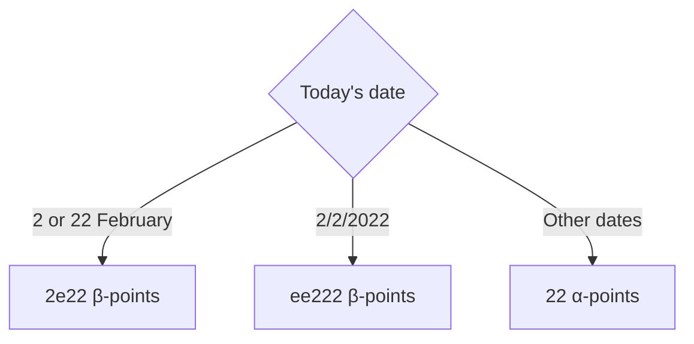

# `patchworkBirb`
a.k.a. 布織天上公雀

## Disclaimer
This document is entirely a joke, and I do not intend to offend anyone. This document is also cringe.

## Trigger Warning
**Cringe Content.** This is very cringe. External links can be *very* cringeworthy ~~and may cause allergic reactions~~.

## Abstract
This document serves to outline a tabletop game concept, which is intentionally over-complicated and confusing.
Game ideas have been permanently borrowed from numerous sources, including preexisting tabletop games and ideas
from the *Be a Board Game Designer* programme.

## Prerequisites
* A computer, defined as any device that fulfills the Turing Machine definition,
  with the below software installed or readily available:
  * Any text editor.
  * A random number generator.
* A full collection of dice from d1 to d100, with at least one each.
* A digital camera that captures in at least 4K resolution, at a rate of at least 2048 FPS.
* A tabletop game designing kit with its full set of cards.
* A few tables and partitions.
* A substantial amount of paper.
* A working printer deemed as non-scam, as a substantial amount of documents is to be scanned.
  * HP printers are NOT recommended.
  * Printers requiring magenta ink are NOT recommended.
* Optionally a fursuit, preferably one of a fox.

## Basic Info
* At least 12 players, recommended 21 players.
  * The number of players should be divisible by 3.
  * Adjust the number of cards based on the amount of players.
* Age rating: 100+.
  * This rule aims to provide this age group with a form of entertainment, as LEGO prohibits them from using their sets.
  * Players under the required age will be sent to Alligator Alcatraz.
* Without Fishy's prior permission, it is unacceptable to simulate the entire game digitally,
  as it violates our intellectual property. DRM software collectively named "Administrative Measures"
  will be taken to ensure compliance. You can imagine what that means. /s

## Plot (irrelevant to game)
Man is Mary’s rival.
Man had once launched a ["special operation" on Mary, occupying 20% of them](https://en.wikipedia.org/wiki/Russian_invasion_of_Ukraine).
They both go on a crowded boat which had capsized, barely surviving, and both [go on a submarine which had imploded](https://en.wikipedia.org/wiki/Titan_submersible_implosion), barely surviving again (plot armour).
Meanwhile, you, the player, have been [Fortnite Battle Passed](https://www.youtube.com/watch?v=uRWPzZmTT8I) into an
island where you’re forced to [wörk](https://www.youtube.com/watch?v=vvANy49Kqhw).

## Winning Conditions
When at least one of these conditions are met, the winning procedure will be conducted.
* 20% of players die or leave the game.
* One player dies in real life.

## Winning Procedure
The winner is deduced by the method below. This also applies to dead players.
1. Compare the γ-points of each player
2. Compare the β-points if γ-points are equivalent
3. Compare the α-points if β-points are equivalent
4. Rock-paper-scissor out the issue if α-points are equivalent,
   use the best-two-of-three basis to ensure maximum randomness
5. If two or more people still tie, sort it out by the one who has a higher age (by birthday, not by fixed age)
   (correct to the nearest Planck time, 5.39 × 10−44 s)
7. If two or more people are the same age, sort it out by the one who had most recently drank water
8. If two or more people had drank water at the same time, use RNG

## Basic Procedures
* Every player has one character card. If done correctly, throughout the entire game,
  each player should have exactly 1 character card.
* Every round, when it is a player's turn, they must draw a card so they have
  two cards to choose from. They then have to play one of the two cards on the *ma pi jaki anpa*.
* After all turns are over, the game switches to Part II, then to The Bigger Picture™,
  where a time limit of 30 minutes is set for each The Bigger Picture round.
* After Part III, a round of Obvious Furbait is conducted before going back to Part I.

## Point Hierarchies
There are three point hierarchies. These are, in ascending order of importance, α-points, β-points, and γ-points. Hosts may extend these point hierarchies.
* Every second, you have a 20% chance of getting 1 α-point.
* Every minute you get the chance to convert 50 α-points to 1 β-point (you can buy multiple), and 50 β-points to 1 γ-point (you can also buy multiple). Both of these conversions NEVER work vice versa.
* If you obtain a negative amount of any point, you die.

A visualisation is as follows:

| α (alpha) | β (beta) | γ (gamma) |
| --- | --- | --- |
| 20% chance/s | 50α | 50β |

## Character Cards
### 1c×2: Slightly Useless Character
* Does *almost* nothing.
* Grants one β-point if it is the only Slightly Useless Character card played in a round.

### 2c×2: 2
* Draw 2 cards and give up any 2 of your cards.
* Points received:

