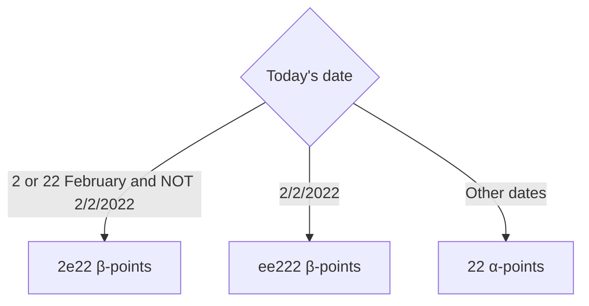

# `patchworkBirb`
a.k.a. 布織天上公雀

## Disclaimer
This document is entirely a joke, and I do not intend to offend anyone. This document is also cringe.

## Trigger Warning
**Cringe Content.** This is very cringe. External links can be *very* cringeworthy ~~and may cause allergic reactions~~.

## Abstract
This document serves to outline a tabletop game concept, which is intentionally over-complicated and confusing.
Game ideas have been permanently borrowed from numerous sources, including preexisting tabletop games and ideas
from the *Be a Board Game Designer* programme.

## Prerequisites
* A computer, defined as any device that fulfills the Turing Machine definition,
  with the below software installed or readily available:
  * Any text editor.
  * A random number generator.
* A full collection of dice from d1 to d100, with at least one each.
* A digital camera that captures in at least 4K resolution, at a rate of at least 2048 FPS.
* A tabletop game designing kit with its full set of cards.
* A few tables and partitions.
* A substantial amount of paper.
* A working printer deemed as non-scam, as a substantial amount of documents is to be scanned.
  * HP printers are NOT recommended.
  * Printers requiring magenta ink are NOT recommended.
* Optionally a fursuit, preferably one of a fox.

## Basic Info
* At least 12 players, recommended 21 players.
  * The number of players should be divisible by 3.
  * Adjust the number of cards based on the amount of players.
* Age rating: 100+.
  * This rule aims to provide this age group with a form of entertainment, as LEGO prohibits them from using their sets.
  * Players under the required age will be sent to Alligator Alcatraz.
* Without Fishy's prior permission, it is unacceptable to simulate the entire game digitally,
  as it violates our intellectual property. DRM software collectively named "Administrative Measures"
  will be taken to ensure compliance. You can imagine what that means. /s

## Plot (irrelevant to game)
Man is Mary’s rival.
Man had once launched a ["special operation" on Mary, occupying 20% of them](https://en.wikipedia.org/wiki/Russian_invasion_of_Ukraine).
They both go on a crowded boat which had capsized, barely surviving, and both [go on a submarine which had imploded](https://en.wikipedia.org/wiki/Titan_submersible_implosion), barely surviving again (plot armour).
Meanwhile, you, the player, have been [Fortnite Battle Passed](https://www.youtube.com/watch?v=uRWPzZmTT8I) into an
island where you’re forced to [wörk](https://www.youtube.com/watch?v=vvANy49Kqhw).

## Winning Conditions
When at least one of these conditions are met, the winning procedure will be conducted.
* 20% of players die or leave the game.
* One player dies in real life.

## Winning Procedure
The winner is deduced by the method below. This also applies to dead players.
1. Compare the γ-points of each player
2. Compare the β-points if γ-points are equivalent
3. Compare the α-points if β-points are equivalent
4. Rock-paper-scissor out the issue if α-points are equivalent,
   use the best-two-of-three basis to ensure maximum randomness
5. If two or more people still tie, sort it out by the one who has a higher age (by birthday, not by fixed age)
   (correct to the nearest Planck time, 5.39 × 10^(−44) s)
7. If two or more people are the same age, sort it out by the one who had most recently drank water
8. If two or more people had drank water at the same time, use RNG

## Basic Procedures
* Every player has one character card. If done correctly, throughout the entire game,
  each player should have exactly 1 character card.
* Every round, when it is a player's turn, they must draw a card so they have
  two cards to choose from. They then have to play one of the two cards on the *ma pi jaki anpa*.
* After all turns are over, the game switches to Part II, then to The Bigger Picture™,
  where a time limit of 30 minutes is set for each The Bigger Picture round.
* After Part III, a round of Obvious Furbait is conducted before going back to Part I.

## Point Hierarchies
There are three point hierarchies. These are, in ascending order of importance, α-points, β-points, and γ-points. Hosts may extend these point hierarchies.
* Every second, you have a 20% chance of getting 1 α-point.
* Every minute you get the chance to convert 50 α-points to 1 β-point (you can buy multiple), and 50 β-points to 1 γ-point (you can also buy multiple). Both of these conversions NEVER work vice versa.
* If you obtain a negative amount of any point, you die.

A visualisation is as follows:

| α (alpha) | β (beta) | γ (gamma) |
| --- | --- | --- |
| 20% chance/s | 50α | 50β |

## Character Cards
### 1c×2: Slightly Useless Character
* Does *almost* nothing.
* Grants one β-point if it is the only Slightly Useless Character card played in a round.

### 2c×2: 2
* Draw 2 cards and give up any 2 of your cards.
* Points received:

### 3c×6: I'm In My Detective Era Now
* Choose a player and ask if their card is of a specific number.
* If their card is the number, the questioned player dies.
* If their card is not the number, nothing happens.

### 4c×1: They Say This Isn’t Balanced, but I Don't Care
* Instantly get a "你是冠軍" card.
* Gain (`d6` × 24) γ-points.

### 5c×2: The Negator from the (H)alting Problem Videos
* Negates *all* effects on you for the entire round, both positive and negative.

### 6c×1: Snap Back to Reality
* Votekick yourself (die).

### 7c×(players-1): Polite *Ploice* Officer
1. A random animal card (chicken, cow, sheep, pig, owl, or ant) appears on the deck.
2. You must name the animal. The name must be absurdly long, contain at least two languages, and have no upper limit.
 * *Example (bare minimum):* `往羅湖的列車即將到達。前往罗湖的列车即將到达。The train to Lo Wu is arriving.`
3. Additional animal cards are added to the deck.
4. When two identical animal cards appear, players race to slap both while shouting its full name.
 * Winner receives **18,446,744,073,709,551,616 (2^64) γ-points**.
 * If no one remembers the name, shuffle the animal cards and restart.

### 8c×2: Discipline Teacher
* May be partially disabled if deemed offensive/unethical. If disabled, gain **500 γ-points** immediately.
* You gain the right to scold the next player for **1 minute** for the worst possible reasons.
* Gain 10 γ-points per utterance of: “Eyes on me,” “Attention please,” or “Absolute silence.”

### 9c×1: The *jan soweli* from idk some random tabletop game
* Roll a `d6`:
  * You gain 1 γ-point.
  * All other players lose the die result in γ-points.
  * Effect is negated for any player holding a *The jan soweli from Schatz der Dr\*chen* card.

### 10c×2: [smonk](https://surrealmemes.fandom.com/wiki/Smonk)
* Both adjacent players lose 1 γ-point.

### 11c×2: [the snow is snowier than before](https://www.reddit.com/r/MinecraftMemes/comments/d9maz9/)
* The player to your left loses 1 γ-point.

### 12c×2: [lave](https://bugs.mojang.com/browse/MC-257104)
* The player to your right loses 1 γ-point.

### 13c×5: Iran out of ideas
* You gain 1 γ-point.

## Ability Cards (a.k.a. Abaty Cards)

### 1a: Hurricane
* Playable at any time.
* Resets one point hierarchy of any player (default: yourself if not chosen within 5 seconds).
* User skips **two rounds**.

### 1a⁻¹: Summer monsoons arrive late
* Playable if *Hurricane* is used against you.
* Negates *Hurricane*.

### 2a: Pray for Peace and Prosperity
* Playable at any time.
* All your stats are ×10.
* Side effect: Other players may use the 🤓 emoji on you; you lose 1 γ-point per use.

### 3a: Rabbit
* Playable at any time.
* A biblically accurate rabbit Usain Bolts toward a player of your choice, nearly killing them.
* Target is hospitalized (skips) for two rounds.

### 3a⁻¹: Usain Bolt
* Playable if *Rabbit* is used against you.
* Negates *Rabbit*.

### 4a: Jumping Expert
* Playable at any time.
* Choose a point hierarchy. It becomes equal to the next higher hierarchy.
* If none is higher, it becomes equal to the next lower.

### 4a⁻¹: Don’t Touch the Hurdles
* Playable if *Jumping Expert* is used on you.
* Negates *Jumping Expert*.

### 5a: [Ono](https://youtube.com/watch?v=sohap152Rcc) Reverse Card
* Playable at any time, or when another *Ono Reverse Card* is played.
* A replica of the *UNO Reverse Card*.

### 6a: Ono Skip All Card
* Playable at any time, or when another *Ono Skip All Card* is played.
* A replica of the *UNO Flip Skip All Card*.

### 7a: Ono [BTS Card](https://www.google.com/search?q=uno+bts+card+rule)
* Playable at any time, or when another *Ono BTS Card* targets you (negates effect).
* Forces next player to perform a BTS dance for two rounds.
* If they fail, they lose 75% of all stats.

### 8a: Black Dice
* Must be played once obtained.
* Requires [*Black Knife (from Deltarune)*](https://www.youtube.com/watch?v=B8Us0DZgexw) to also be played.
* Kill one adjacent player. [Negated if target has a fursona with antlers](https://knowyourmeme.com/memes/asgore-running-over-dess).
* If both adjacent players are dead, you die.

### 9a: 收你八折
* Playable when a negative effect targets you.
* Reduces the negative effect by 20%.

### 10a: 收你五折
* Playable when a negative effect targets you.
* Reduces the negative effect by 50%.

### 11a–20a: +n Cards (1 ≤ n ≤ 10)
* Playable at any time.
* Add `n` to any one hierarchy.

### 21a: ×2 Card
* Playable at any time.
* Doubles any one hierarchy.

### 22a: ^2 Card
* Playable at any time.
* Squares any one hierarchy.

### 23a: ^^² Card
* Playable at any time.
* Tetrates any one hierarchy by 2.

### 24a: –5 Card
* Must be played once obtained.
* Deducts 5 points from your highest hierarchy.

### 25a: /2 Card
* Must be played once obtained.
* The IRS chooses which of your hierarchies to halve.

### 26a: √x Card
* Must be played once obtained.
* Square-roots one hierarchy.

### 27a: √√x Card
* Must be played once obtained.
* Fourth-roots one hierarchy.

### 28a: The *jan soweli* from Schatz der Dr\*chen
* Must be played once obtained (“a life-changing experience”).
* Converts you into a *jan soweli*.
* Resets all point hierarchies except one.
* Thereafter remains in inventory, granting 5 γ-points at game end.

### 29a: Cat
* Must be played once obtained.
* Gain 15 γ-points, then card remains in inventory.
* Cannot coexist with *Dog*; if both are held, both are returned and all hierarchies reset (unless you hold *The jan soweli…* card (28a)).

### 30a: Dog
* Must be played once obtained.
* Player must quote [“dog” (cringe warning)](https://www.youtube.com/watch?v=3NWdCihcOHM).
* Gain 15 γ-points, then card remains in inventory.
* Cannot coexist with *Cat*; if both are held, both are returned and all hierarchies reset (unless you hold *The jan soweli…* card (28a)).

### 31a: Wolf
* Remains in inventory once obtained.
* Continuously removes any *Dog* from your inventory (source: my dumb classmates’ logic).
* Exception: Negated if you hold *The jan soweli…* card (28a).

### 32a: Ball Pen
* Playable at any time.
* Adjacent player multiplies all stats by 20%.

### 33a: Empty Room
* Does nothing.

### 34a: Vacuum
* …

### 35a: Sofa
* Must be used once obtained.
* Skip one round, then gain 50 γ-points.

### 36a: Store
* Must be used once obtained.
* Skip 5 rounds, then gain 100 γ-points per round for 10 rounds.

### 37a: Scavenger
* Playable at any time.
* Choose any of the first 10 cards from *ma pi jaki anpa* (excluding *Scavenger*).

### 37a⁻¹: Trash
* Playable at any time.
* If a *Scavenger* user draws this, their round ends and they must keep it.
* Otherwise does nothing.

### 38a: Stand Up. Let’s Have a Greeting
* Playable at any time.
* All players must stand up.
* The slowest player transfers 75% of every stat to the fastest.
* Measured with ≥2048 FPS camera.

### 39a: *jan soweli* who is only 105 cm tall and can only say [“ger river”](https://en.wikipedia.org/wiki/Niger_River)
* Playable at any time.
* All players who know the 105 cm “ni”-saying comic lose all stats.
* Negated if player owns *The jan soweli…* card (28a).
* Does not work if the player has hailed anything (including a taxi) in the past month.

### 40a: Lion
* Playable at any time.
* The next player dies and you receive all their stats.
* Negated if target owns *The jan soweli…* card (28a).

### 41a: Grass
* Playable at any time.
* Player with most Discord/ activity time loses 50% of all stats.
* If no one uses Discord, everyone loses 1% of all stats.

### 41a⁻¹: [Please Take a Shower Immediately](https://knowyourmeme.com/photos/2301828-strange-duolingo-sentences)
* Playable if *Grass* targets you.
* Negates *Grass*.
* Stats of the *Grass* player are transferred to you and doubled by the bank.

### 42a: Abaties of Characters
* Playable at any time.
* Next player dies “because the card misspelt Abilities and forgot to use Grammarly.”

### 42a⁻¹: [Um Actually](https://knowyourmeme.com/memes/nerd-emoji)
* Playable if *Abaties of Characters* targets you.
* Negates *Abaties of Characters*.
* Side effect: Other players may use the 🤓 emoji on you; you lose 1 γ-point per use.

### 43a: 💔❤️‍🩹
* Playable at any time if you are under a negative effect.
* Negates that effect.

### 44a: ❤️‍🩹💔
* Playable at any time.
* Negates a player’s positive effect.
* If no player has a positive effect, you die.

### 45a: Denied ❌
* Playable at any time.
* Denies usage of any one card until an *Approved* card lifts the denial.
* Forbidden to pick *Approved* as the denied card.

### 45a⁻¹: Approved ✅
* Playable at any time while a *Denied* card is active.
* Lifts the denial of one *Denied* card.

### 46a: generic [swer](https://youtube.com/watch?v=XXfFGxCwNtQ) [wolf](https://www.reddit.com/r/youngpeopleyoutube/comments/1qg4iti/what/) character
* Playable at any time.
* Choose a player. That player dies when you die.

### 47a: 被劣
* Playable at any time.
* All cards move one position to the right.

### 48a: Kindness
* Playable on your round.
* You are so kind you wanted your friend to have equal opportunities as you.
* Target player must discard their entire hand and redraw the same number of cards.
* Remember Michael Larry Pete Cloppington's quote: "Friendship is magic, the magic of starting over."

### 49a: Союз Нерушимый Республик Свободных
* Playable on your round.
* Privyet comrade, remember the class struggle.
* The total sum of γ-points among all living players is calculated, then divided evenly. Each player receives their share, rounded down to the nearest integer. Any remainder points (the "proceeds less than 1 point") are given to the State (removed from the game).
* "From each according to his ability, to each according to his need for integers."

### 50a: Trade Secret
* Playable on your round.
* Everyone else's face-down Trap Cards are immediately flipped face-up and remain visible to all players for the rest of the game.

### 51a: DRM
* Playable whenever any player uses the Scavenger card.
* The Scavenger uses DRM-ridden software rendered unusable.
* The effects of the Scavenger card are completely negated. The user of Scavenger gains nothing, and their turn ends.

### 52a: The Inquisition
* Nobody expects the patchworkBirb inquisition. Maybe.
* Playable on your round.
* You must declare one of two categories: "Stupidly Easy" or "How Do You Even Know This".
* A question from the chosen category is then selected at random from a predetermined list.
* All players present, including you and those whose rounds are skipped, must answer the question within 30 seconds.
* Any player who answers correctly gains 5 γ-points. Any player who answers incorrectly loses 10 γ-points. Any player who submits a blank answer, an illegible answer, or the word "ger river" loses 15 γ-points.

#### 52a Sample Questions
##### Stupidly Easy
* What is the sum of the multiplicative identity and the only even prime number?
* To avoid being scammed, should you take the advice of a scammer?
* What is the powerhouse of the cell?
* For all real numbers x, is x^2 = x^2?

##### How Do You Even Know This
* Who was in Paris? Ensure your answer is inoffensive. Do not use the "clean" version as your answer.
* Is P = NP?
* Prove or disprove the Riemann hypothesis.
* Come up with Ramanujan's approximation for pi using his methods. You are given a bed and a time limit of 1 hour. For this question, all trap cards are temporary null and void.
* Use ISO 843 transliteration on the full lyrics of "Hymn to Liberty" (the national anthem of Greece), disregarding spaces. Convert the result into Unicode codepoints (all in denary, assuming UTF+8). What is the sum of all the codepoints?
* Who farted at exactly 3:01.22 AM GMT on 9 August 1945?

---

## Trap Cards
* If drawn, flip it face-up on the table and draw another card.
* Active until someone matches its description (except you).
* Only you may flip it.
* May be disabled for ethical reasons.

### 1t: Prosecuted for Damaging Property
* If anyone bangs the table, they lose 50 γ-points.
* Others may pretend to be offended (Twitter-style argument); target loses 1 γ-point per “outrage.”

### 2t: What’s the Time?
* If anyone checks a clock/watch, they lose 50 γ-points.

### 3t: 🤓
* If anyone wears glasses, they lose 1 γ-point.
* If anyone confuses this with the *i-42a* card, they die.

### 4t: [You may not sleep now](https://www.reddit.com/r/Minecraft/comments/9h0f7u/you_may_not_rest_there_are_monsters_nearby/), there are [monsters](https://www.youtube.com/watch?v=MobkO51msMI) nearby:
* If anyone sets down cards or [rests/sleeps](https://www.youtube.com/watch?v=ZUUHX8P1dy4), they lose 50 γ-points.

---

## Special Cards
* Cannot be drawn; given at game start to qualifying players.

### 1s: The Entire Bakery
* Given if today is your birthday.
* Gain 100 γ-points at game start.

---

## Part II: Welcome to Game Theory
[The show that gets facts wrong about YOUR favourite conlang.](https://tvtropes.org/pmwiki/pmwiki.php/WebVideo/ConlangCritic) Wait, wrong show.

### Setting
* Players divided into three groups (A, B, C) or two groups (A, B) depending on divisibility by three. Each group starts with 10 points.
* If a group reaches 0 points, 15% of its members die (round up).

### Rounds 1–3
* Each group privately chooses 1 or 0.
* If another group learns your choice, all players die.
* After 30-second discussion, groups reveal choice.

If amount of players is divisible by 3:

| Scenario (甲,乙,丙) | Result | Δ Points (甲,乙,丙) |
|-------------------|--------|-------------------|
| 1,0,0             | 甲 gives 1 point to each other group | –2, +1, +1 |
| 1,1,0             | Groups Z and 丙 give 2 points to other | –2, –2, +4 |
| 1,1,1             | Each group gains 1 point | +1, +1, +1 |
| 0,0,0             | Each group loses 2 points | –2, –2, –2 |

Else:

| Scenario (甲,乙) | Δ Points (甲,乙) |
|-------------------|-------------------|
| 1,0             | +2, -8 |
| 1,1             | –2, –2 |
| 0,0             | +1, +1 |

### Rounds 4–5
* Same as above, but each group sends a representative to a separate discussion room.

---

## Part III: The Bigger Picture™
*If you die here, you die in the entire game.*

### Setting
Freely walk in this area:

### Ability Points
* Start with 18 ability points, distributable among four color-coded categories: A, B, C, D.

### Goals
| Goal | Description |
|------|-------------|
| ★ why | Do every single Wörk. |
| ★ real I | Get 10 A, 15 B, 5 C, 15 D. |
| ★ real II | Get 20 A, 10 B, 5 C, 8 D. |
| ★ [smort](https://www.urbandictionary.com/define.php?term=Smort) | Reach Level 4 in the first *The Bigger Picture* round. |
| ★ Waist of Time | Get 25 A points. |
| ★ [We work to earn the right to work](https://www.youtube.com/watch?v=vvANy49Kqhw) | Do the same Wörk 5 times. |
| ★ monet I | Get 10 C points. |
| ★ monet II | Get 40 C points. |

★ = harder, ☆ = easier.

### Diabetes Land
* Optional after achieving a goal.
* Awarded sugar (mono-/disaccharides) based on goal difficulty.
* No responsibility for side effects (e.g., [OBCD](https://en.wikipedia.org/wiki/Obesity), diabetes).

### Leveling System and Exams
* Start at random level 1–3 (max 4).
* To level up, pass a “meaningless, pointless, and very hard” exam (10 minutes, 7/10 correct).

| Exam | Lv. | Req. (A,B,C,D) | Result (ΔA,ΔB,ΔC,ΔD) |
|------|-----|----------------|----------------------|
| 1→2  | 1   | 3,3,1,2        | –3,–3,–1,–2 |
| 2→3  | 2   | 5,4,2,3        | –5,–4,–2,–3 |
| 3→4  | 3   | 8,5,3,5        | –8,–5,–3,–5 |

### Special Events
* Occur randomly (5–10 minute intervals), affect all players.

| Event | Result (ΔA,ΔB,ΔC,ΔD) |
|-------|----------------------|
| Economic Growth | 0, 3, 0, 5 |
| [David-19](https://www.reddit.com/r/facepalm/comments/qwth5d/the_david19_situation/) | 2, –5, –5, –5 |
| global tsunami | 0, 0, 0, –20 |

### Fate Cards
* 100% optional gambling.
* Draw one card:

| Card | Result (ΔA,ΔB,ΔC,ΔD) | Additionally |
|------|----------------------|--------------|
| RNG | *na*, *nb*, *nc*, *nd* | Admit gambling publicly; gain 1 Gambling Point. |
| die | –∞, –∞, –∞, –∞ | Write your own obituary, quit game, buy a coffin, live in it forever. |

`n_a … n_d` are random integers –50 ≤ n ≤ 50.

### Gambling Points
| Item | Points | Stock |
|------|--------|-------|
| expired chocolate (ℓ) | 5 | ∞ |
| [Ono BTS dance card](https://antifandom.com/matteluno/wiki/Wild_Dancing_Card) | 10 | 1 (re-stocked after use) |
| “Doth Not Walk For 15 Minutes” card | 15 | 1 (re-stocked after use) |
| “Name Five Stations from Any Metro Line” card | 20 | 1 (re-stocked after use) |

* If a card’s requirement is not met, the target dies.

### [Wörk](https://knowyourmeme.com/photos/1092543-polandball) and Non-Wörk
*Wörk list:*

| Wörk | Description | Lv. | Req. (A,B,C,D) | Result (ΔA,ΔB,ΔC,ΔD) |
|------|-------------|-----|----------------|----------------------|
| janitor | pick up rubbish | 1 | 0,0,1,0 | 0,0,-1,1 |
| gift | create gifts | 1 | 0,0,0,0 | 6,3,1,0 |
| mailman | deliver gifts | 1 | 2,2,1,0 | 2,0,-1,2 |
| Carprark man  | tidy up toy cars, especially if you are Holy Number 6 | 1 | 1,1,2,0 | 0,0,-1,2 |
| find | find waldo | 1 | 0,0,0,0 | 6,0,1,0 |
| 2/3 | [this](https://en.m.wikipedia.org/wiki/Three-legged_race) | 1 | 0,0,2,5 | 2,6,-2,-5 |
| [⿰王理工大學](https://www.hk01.com/18%E5%8D%80%E6%96%B0%E8%81%9E/1060488/%E7%90%86%E5%A4%A7%E5%AE%A3%E5%82%B3%E6%A9%AB%E5%B9%85%E8%98%87%E8%BB%BE%E5%90%8D%E5%8F%A5-%E5%8D%83%E9%87%8C%E5%85%B1%E5%AC%8B%E5%A8%9F-%E8%AE%8A-%E5%8D%83%E8%A3%A1-%E6%83%B9%E7%86%B1%E8%AD%B0%E5%BE%8C%E5%B7%B2%E6%8B%86%E9%99%A4) | find typos | 2 | 6,1,1,0 | 2,0,-1,3 |
| [airplane](https://www.youtube.com/watch?v=S6ff6_beeHY) | jump and stick memos | 2 | 3,0,3,0 | 2,0,-3,5 |
| [graphic design](https://www.reddit.com/r/DesignPorn/comments/a0fb98/beautiful_example_of_design/) | write your name in calligraphy | 3 | 2,0,1,0 | 1,0,-1,3 |
| programmer | do intense math | 3 | 3,1,1,0 | 2,0,–1,5 |
| [surgeon](https://www.youtube.com/watch?v=8byiwOY5XM0) | [be a surgeon](http://youtube.com/watch?v=-ES-5HtpoxU) | 4 | 6,3,0,3 | –3,2,–3,10 |

*Non-wörk:*

| Misc. | Req. (A,B,C,D) | Result (ΔA,ΔB,ΔC,ΔD) |
|-------|----------------|----------------------|
| medical | 0,0,0,5 | 0,0,1,–5 |

---

## Part IV: Obvious Furbait
* After each Part III round, ask a fursuiter the time.
* If the time is exactly 12:00 a.m. or p.m., all players must run.
* The slowest runner dies.
